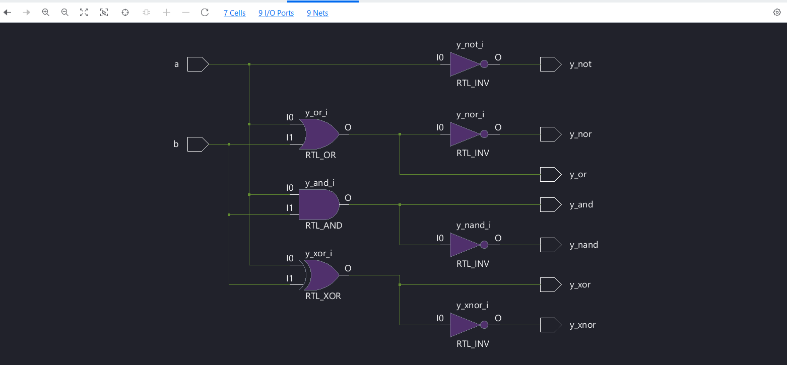
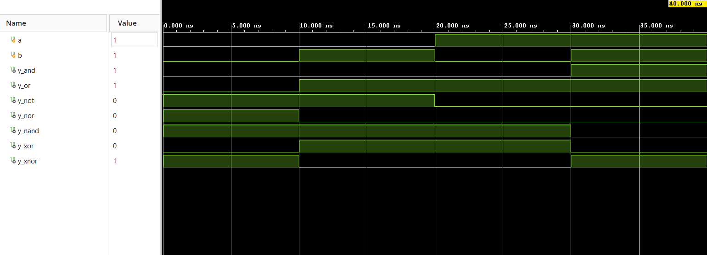

# Digital Gates using Verilog HDL

A Verilog HDL project implementing the fundamental digital logic gates. This project demonstrates the design, simulation, and verification of basic combinational logic circuits using Xilinx Vivado.

---

## 📁 Project Structure

```
Digital_Gates/
│
├── RTL/
│   └── digitalgate.v
│
├── Testbench/
│   └── tb_digitalgate.v
│
├── DigitalGate_Schematic.png
├── DigitalGates_Output.png
└── README.md
```

---

## 🚀 Features

This project implements the following digital logic gates:

- AND Gate
- OR Gate
- NOT Gate
- NAND Gate
- NOR Gate
- XOR Gate
- XNOR Gate

---

## 🛠️ Tools Used

- Verilog HDL
- Xilinx Vivado 2026.1
- Vivado Simulator

---

## 📥 Inputs

| Signal | Description |
|---------|-------------|
| a | Input A |
| b | Input B |

---

## 📤 Outputs

| Signal | Description |
|---------|-------------|
| y_and | AND Output |
| y_or | OR Output |
| y_not | NOT Output |
| y_nand | NAND Output |
| y_nor | NOR Output |
| y_xor | XOR Output |
| y_xnor | XNOR Output |

---

## 📖 Truth Table

| A | B | AND | OR | NAND | NOR | XOR | XNOR | NOT(A) |
|:-:|:-:|:---:|:--:|:----:|:---:|:---:|:-----:|:------:|
|0|0|0|0|1|1|0|1|1|
|0|1|0|1|1|0|1|0|1|
|1|0|0|1|1|0|1|0|0|
|1|1|1|1|0|0|0|1|0|

---

## 📝 RTL Design

The RTL schematic generated by Vivado is shown below.



---

## 📊 Simulation Results

Behavioral simulation waveform obtained from the Vivado Simulator.



---

## ▶️ How to Run

1. Open **Xilinx Vivado**.
2. Create a new RTL Project.
3. Add `RTL/digitalgate.v` as a Design Source.
4. Add `Testbench/tb_digitalgate.v` as a Simulation Source.
5. Run **Behavioral Simulation**.
6. Verify the outputs using the waveform.

---

## 📚 Learning Outcomes

Through this project, I learned:

- Verilog module creation
- Input and output port declaration
- Continuous assignment (`assign`)
- Implementation of combinational logic
- Testbench development
- Behavioral simulation
- RTL schematic generation
- Functional verification using waveforms

---

## 🔮 Future Improvements

- Parameterized gate design
- Gate delay modeling
- Gate-level simulation
- SystemVerilog implementation
- FPGA implementation and hardware testing

---

## 👨‍💻 Author

**Shaswat Tripathi**

B.Tech Electronics & Communication Engineering

Aspiring Digital VLSI / ASIC Design Engineer

GitHub: https://github.com/Shaswat-VLSI

---
⭐ If you found this project useful, consider giving it a star!
